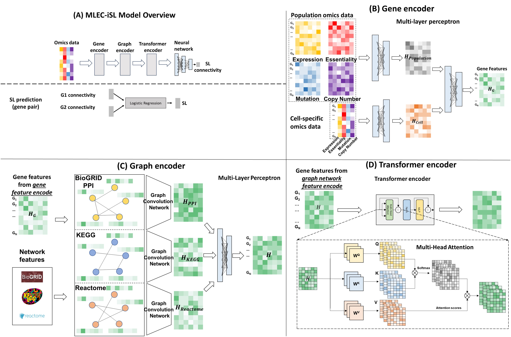

# MLEC-iSL
 **A multi-layer encoder model for individual sample-specific synthetic lethality prediction**

This is the original code for our work "Graph transformer guided synthetic lethality prediction". Our model, MLEC-iSL, is an end-to-end deep learning model, composed of four modules: gene feature encoder, multi-view graph encoder, transformer encoder and predictor. Predictive performance benefited from use of the transformer encoder as well as SL connectivity as an intermediate learning objective, and our method outperformed state-of-the-art deep-learning methods by a large margin. 

Here shows the entire model architecture:


## Requirements

We use `torch` to build our deep learning model, and **PyG (PyTorch Geometric)** library to implement graph neural network module. Here are a list of packages required to run our model:      

- numpy
- pandas
- scipy
- scikit-learn
- networkx
- argparse
- tqdm
- torch
- torch-geometric

Alternatively, the packages could be installed through requirements.txt as:
```
pip install -r requirements.txt
```

## Download data

In order to run our model, you should first download data from [this link](https://data.mendeley.com/datasets/7shf34snd3/1), which contains features and two SL datasets (K562 and Jurkat cell lines), and put these files into a folder named **data**. 

There are two types of features used in our model: omics features and biological networks. For omics features, there are two CCLE profiles (expression and essentiality) and four cell-specific features (expression, essentiality, mutation and copy number) considered in our model. As for network features, we incorporate physical protein-protein interaction (PPI) network, genetic interaction network and pathway network.

## Run the model
```
cd code
python main.py
```
By default, the model runs on the 'K562' cell line using all three graph features, two CCLE profiles and four types of sample-specific omics features as the input.      
Please refer to "main.py" for a list of model-related hyper-parameters to be adjusted.
